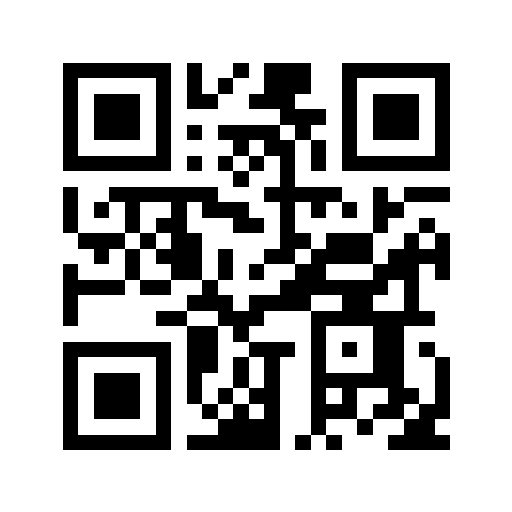

# QR API

Generate QR Codes via API.

## Usage

> Use it via this base url [https://qr.tarasyarema.com](https://qr.tarasyarema.com).

### `GET /encode`

Accepts the following parameters

- `data (string)` is the url encoded data you want to encode.
- `size (int)` is the size of the QR. Default is `256`.
- `quality (int={0,1,2,3})` quality of the QR compression, the more, the better. Default is `1`, i.e. medium.

Returns a PNG image, i.e. the response has the `Content-Type` header set to `image/png`.

### Example request

The request `GET /encode?size=512&quality=2&data=This%20is%20a%20test` would return something like this

## Build and run

You may set an environment variable `PORT` if you want to change the default (`8080`) server port.

### Via `go`

1. `go build`
1. `./qr-api`

### Via Docker Hub

`docker run -p 8080:8080 tarasyarema.com/qr-api:latest qr-api`

### Via Docker locally

1. `docker build -t qr-api .`
1. `docker run -p 8080:8080 qr-api:latest`
